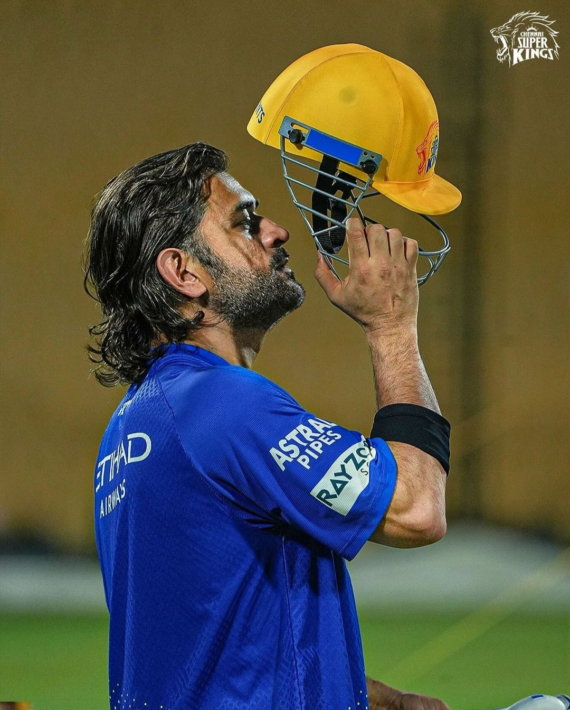

# OASIS INFOBYTE - Web Development and Designing

This repository contains a tribute page web application developed as part of Level 2 Task 2 for my OIBSIP internship program.

## Tribute to M. S. Dhoni

A tribute page dedicated to Mahendra Singh Dhoni, one of the greatest cricket captains of all time, affectionately known as Captain Cool.

## Introduction

The tribute page includes information about M. S. Dhoni's achievements, a captivating video of his highlights, and a memorable quote from the man himself.

## Preview

## Technologies Used

- HTML
- CSS

## Setup

To view this project, simply open the `index.html` file in your preferred web browser.

## Features

- Informative header with images of M. S. Dhoni
- Embedded video showcasing Dhoni's career highlights
- Showcase of Dhoni's notable achievements
- Memorable quote section

## Credits

- Tribute page content and design by Dhanush S
- Images sourced from the internet
- Video embedded from [YouTube](https://www.youtube.com/watch?v=b4OH3vBANa4)

## Acknowledgements

Special thanks to M. S. Dhoni for inspiring millions of cricket fans around the world.

---

